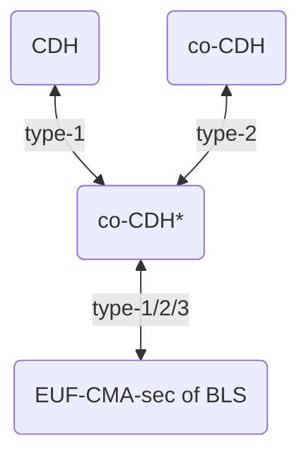

> **Chapter status:** in good shape
>
> **TODO:**
> - write a more rigorous game-based proof for BLS
> - write the security proof for aggregate BLS signatures

# BLS Signatures

The BLS signature scheme was proposed by Boneh, Lynn, and Shacham [[BLS01](../references.md#BLS01)] (see also the corresponding journal paper [[BLS04](../references.md#BLS04)] and the [IETF draft](https://datatracker.ietf.org/doc/html/draft-irtf-cfrg-bls-signature-05)) and was one of the first applications of pairings to cryptography (shortly after tripartite Diffie-Hellman and identity-based encryption).
Note that the BLS initialism can refer to two different things in cryptography: Boneh-Lynn-Shacham signatures discussed in this chapter and Barreto-Lynn-Scott curves, a family of [pairing-friendly elliptic curves](../mathematical-preliminaries/pairings.md).
It is possible to implement BLS (signatures) on BLS (curves).

## Contents

<!-- toc -->

## Signature Schemes: Definitions

We briefly recall standard definitions for signature schemes.

A signature scheme consists of four algorithms:

- a $\setup$ algorithm which takes as input the security parameter $\secparam$ and returns public parameters $par$;
- a key generation algorithm $\keygen$ which takes as input parameters $par$ and returns a secret key $sk$ and a public key $pk$;
- a signature algorithm $\sign$ which takes as input parameters $par$, a secret key $sk$, and a message $m$ and returns a signature $\sigma$;
- a verification algorithm $\verif$ which takes as input parameters $par$, a public key $pk$, a message $m$, and a signature $\sigma$ and returns 1 if the signature is valid for the pair $(pk,m)$ and 0 otherwise.

The scheme is correct if for every security parameter $\secpar$ and every message $m$, the following game capturing the nominal execution of algorithms returns true with probability 1:

\[\boxed{\begin{aligned}
 & par \gets \setup(\secparam) \\
 & (sk,pk) \gets \keygen(par) \\
 & \sigma \gets \sign(par,sk,m) \\
 & b \gets \verif(par,pk,m,\sigma) \\
 & \pcassert (b=1)
\end{aligned}}\]

The standard security notion for a signature scheme is *existential unforgeability against chosen message attacks* (EUF-CMA): no polynomial-time adversary, being given a target public key $pk^*$ and having access to a signature oracle for the corresponding secret key $sk^*$, should be able to compute a valid signature for a message it has not queried to the signature oracle, except with negligible probability.
This is formally captured by the following security game:

\[
 \def\arraystretch{\myarraystretch}
 \boxed{
 \begin{array}{ll}
  \text{\underline{Game EUF-CMA:}} & \qquad \text{\underline{Oracle $\orcl{Sign}(m)$:}} \\
  par \gets \setup(\secparam) & \qquad \sigma \gets \sign(par,sk^*,m) \\
  (sk^*,pk^*) \gets \keygen(par) & \qquad \cQ \gets \cQ \cup \{m\} \\
  \cQ \defeq \emptyset & \qquad \pcreturn \sigma \\
  (m^*, \sigma^*) \gets \adv^{\orcl{Sign}}(par,pk^*) & \\
  \pcassert (m^* \notin \cQ) & \\
  \pcassert (\verif( par,pk^*,m^*,\sigma^* )=1) &
 \end{array}
 }
\]

## Description of BLS

Let $\pairingsetup$ be a [pairing group setup algorithm](./games-models-and-assumptions.md#group-setup-algorithms).
The BLS signature scheme is defined as follows:

- The $\setup$ algorithm, on input the security parameter $\secparam$, runs
\[
 (\GG_1,\GG_2,\GG_t,r,e) \gets \pairingsetup(\secparam)
\]
and draws a random generator $G_2$ of $\GG_2$.
It also specifies a hash function $H \colon \{0,1\}^* \to \GG_1$ mapping bit strings to group elements in $\GG_1$.
The public parameters consist of the tuple
\[
 par = (\GG_1, \GG_2, \GG_t, r, e, G_2, H).
\]

- The key generation algorithm $\keygen$ draws a random scalar $x \sample \ZZ_r$ and computes the point $X = x G_2$ on curve $\GG_2$; the secret key is $x$ and the public key is $X$.

- The signature algorithm $\sign$, on input a secret key $x$ and a message $m$, computes the point $S = x H(m)$ on curve $\GG_1$; the signature is $S$.

- The verification algorithm, on input a public key $X$, a message $m$, and a signature $S$, returns 1 (i.e., declares the signature valid) if
\[
 e(S, G_2) = e(H(m), X),
\]
otherwise it returns 0 (invalid signature).

A good way to think of BLS signatures is as follows: given a message $m$ with corresponding point $H(m)$ in $\GG_1$, the signature of $m$ is the point $S$ such that the discrete logarithm of $S$ in base $H(m)$ is equal to the discrete logarithm of $X$ in base $G_2$ (that is, the secret key $x$).
This is reminiscent of the Chaum-Antwerpen undeniable signature scheme [[CA89](../references.md#CA89)].
Checking discrete logarithm equality is exactly what the pairing $e$ enables to do efficiently.

Note that the signature algorithm is deterministic and hence always returns the same signature for a given secret key/message pair; this is called a *unique signature scheme*.

The roles of $\GG_1$ and $\GG_2$ can be swapped, in which case public keys are in $\GG_1$ and signatures in $\GG_2$ (recall that bit string representations of elements are larger and arithmetic is less efficient for $\GG_2$ than for $\GG_1$, so the choice depends on what is more important to optimize depending on the use case).
In that case, the hash function must have outputs in $\GG_2$ and hence this is not possible with a type-2 pairing.

The scheme is correct, meaning that for every key pair $(x, X)$ possibly output by the key generation algorithm and every message $m$, the signature $S$ computed by the signature algorithm is declared valid by the verification algorithm.
Indeed,
\[\begin{aligned}
 e(S, G_2) & = e(x H(m), G_2) \\
 & = e(H(m), G_2)^x \\
 & = e(H(m), x G_2) \\
 & = e(H(m), X).
\end{aligned}\]

## Security of BLS

### Security Proof

The BLS scheme is provably EUF-CMA-secure assuming the so-called [co-CDH$^*$ problem](./games-models-and-assumptions.md#computational-co-diffie-hellman-co-cdh-1) is hard for $(\GG_1, \GG_2)$ and modeling the hash function $H$ as a random oracle.
The co-CDH$^*$ problem for two groups $\GG_1$ and $\GG_2$ of order $r$ is defined as follows: given random generators $G_1$ and $G_2$ of $\GG_1$ and $\GG_2$ respectively, $X_1 = xG_1$ and $X_2 = xG_2$ for $x \sample \ZZ_r$, and a random group element $Y \in \GG_1$, compute $xY$.
This might be thought of as CDH in $\GG_1$ with additional "hint" $(G_2, X_2=x G_2) \in \GG_2^2$.

**Theorem 1.**
*Assume that the co-CDH$^*$ problem is hard for $\pairingsetup$.
Then the BLS signature scheme is EUF-CMA-secure in the random oracle model for $H$.
More precisely, for any adversary $\adv$ against the EUF-CMA security of BLS making at most $\qh$ random oracle queries and $\qs$ signature queries, there exists an adversary $\bdv$ for the co-CDH$^*$ problem running in time similar to the time of $\adv$ and such that*
\[
 \advantage{\adv}{euf-cma}(\secpar) = (\qh+1) \advantage{\bdv}{co-cdh$^*$}(\secpar).
\]

> *Proof.*
Let $\adv$ be an adversary against the EUF-CMA security of BLS making at most $\qh$ random oracle queries and $\qs$ signature queries.
From $\adv$, one can easily construct an adversary $\adv'$ having the same advantage as $\adv$ and such that (i) $\adv'$ always makes the random oracle query $\orcl{H}(m^*)$ before returning its forgery $(m^*,S^* )$ and (ii) $\adv'$ makes exactly $\qh+1$ random oracle queries.
From now one, we assume that $\adv$ satisfies properties (i) and (ii).
>
> We construct an adversary $\bdv$ for the co-CDH$^*$ problem as follows.
$\bdv$ takes as input pairing group parameters $pgpar = (\GG_1,\GG_2,\GG_t,r,e)$ and a co-CDH$^*$ instance $(G_1,X_1,G_2,X_2,Y)$ with $X_1 = xG_1$ and $X_2 = xG_2$.
It runs $\adv$ on input BLS parameters $(\GG_1,\GG_2,\GG_t,r,e,G_2,\orcl{H})$ where $\orcl{H}$ is the interface to the random oracle (that $\bdv$ will simulate) and public key $X_2$.
At the beginning of the simulation, $\bdv$ draws a random integer $i^* \sample \{1,\dots,\qh+1\}$ and initializes a table $T$ for storing answers of the simulated random oracle $\orcl{H}$.
When $\adv$ makes a random oracle query $\orcl{H}(m)$ such that $T(m)$ has not been defined yet, $\bdv$ either draws $\rho_i \sample \ZZ_r$ and returns $T(m) \defeq \rho_i G_1$ if this is the $i$-th query, $i \neq i^*$, or returns $T(m) \defeq Y$ if this is the $i^*$-th query.
When $\adv$ makes a signing query $\orcl{Sign}(m)$, then:
> - if $T(m)$ is undefined, then $\bdv$ draws $\rho \sample \ZZ_r$, sets $T(m) \defeq \rho G_1$, and returns the signature $S \defeq \rho X_1$; note that this signature is valid since $S = \rho x G_1 = x T(m)$;
> - if $T(m)$ has already been defined, this was necessarily during the query $\orcl{H}(m)$ made by $\adv$; if this was the $i$-th query, $i \neq i^*$, then $\bdv$ returns the signature $S \defeq \rho_i X_1$; again, this signature is valid since $S = \rho_i x G_1 = x T(m)$; otherwise, if $T(m)$ was defined by the $i^*$-th query, then $\bdv$ aborts the simulation of the game and returns $\bot$.
>
> Eventually, when $\adv$ halts and returns its forgery $(m^*,S^*)$, three cases can occur (recall that by assumption $\adv$ made the random oracle query $\orcl{H}(m^*)$, hence $T(m^*)$ is necessarily defined):
> - if $(m^*,S^*)$ is not a valid forgery (either because $m^*$ was queried to the sign oracle or because the signature is invalid), then $\bdv$ returns $\bot$;
> - if $(m^*,S^*)$ is a valid forgery and $T(m^*)$ was defined during the $i$-th query to the random oracle, $i \neq i^*$, the $\bdv$ returns $\bot$;
> - if $(m^*,S^*)$ is a valid forgery and $T(m^*)$ was defined during the $i^*$-th query to the random oracle, then $\bdv$ returns $S^*$ as solution to the co-CDH$^*$ instance.
>
> In the third case, one can easily check that $S^*$ is the correct solution since $T(m^*)$ was defined as $Y$ so that $S^* = xT(m^*) = xY$.
Moreover, conditioned on $\adv$ being successful, the view of $\adv$ is independent from $i^*$ and hence the third case occurs with probability $1/(\qh+1)$.
Hence,
\[
 \advantage{\bdv}{co-cdh$^*$}(\secpar) = \frac{1}{\qh+1} \advantage{\adv}{euf-cma}(\secpar).
\]

This reduction loses a factor roughly $\qh$ in its success probability.
One can obtain a better reduction losing a factor $\qs$ by using a slightly more careful strategy for "embedding" the challenge $Y$ in the random oracle answers, see [Section 15.5.1 of the Boneh-Shoup textbook](http://toc.cryptobook.us/book.pdf#subsection.15.5.1).

### Discussion

The various statements and proofs of the security of BLS signatures in the literature can be confusing.
The security theorem that we just proved holds for any pairing group setup algorithm.
However, depending on the [pairing type](./games-models-and-assumptions.md#group-setup-algorithms), it can be rephrased slightly differently.

The original conference paper [[BLS01](../references.md#BLS01)] was only considering symmetric (a.k.a. type-1) pairings (i.e., $\GG_1 = \GG_2 = \GG$) and proved EUF-CMA security assuming the CDH problem in $\GG$ is hard.
[Theorem 1](#th:BLS_security) implies this specific case since for type-1 pairings, hardness of co-CDH$^*$ is equivalent to hardness of CDH in $\GG$, as we prove now.

**Proposition.**
*Let $\pairingsetup$ be a type-1 pairing group setup algorithm.
Then co-CDH$^*$ $\equiv$ CDH.*

> *Proof.*
One the one hand, co-CDH$^*$ $\leqq$ CDH is trivial.
On the other hand, CDH $\leqq$ co-CDH$^*$ can be proved as follows.
Let $\adv$ be an algorithm for the co-CDH$^*$ problem.
We construct an algorithm $\bdv$ for solving CDH as follows.
On input $(G_1,X_1=xG_1,Y) \in \GG^3$, $\bdv$ draws a random value $\rho \sample \ZZ_r \setm \{0\}$ and computes $G_2 \defeq \rho G_1$ and $X_2 \defeq \rho X_1$.
Then $X_2 = \rho xG_1 = x G_2$ and $G_2$ is distributed uniformly in $\GG \setm \{0\}$ and independently from $G_1$.
Hence, $(G_1,X_1,G_2,X_2,Y)$ is a correctly distributed instance of co-CDH$^*$ that $\bdv$ can pass as input to $\adv$.
The solution $xY$ of this co-CDH$^*$ instance is also the solution to the original CDH instance.
Hence, the advantage of $\bdv$ is equal to the advantage of $\adv$.

Later, the journal paper [[BLS04](../references.md#BLS04)] considered asymmetric pairings ($\GG_1 \neq \GG_2$) for which an efficiently computable group isomorphism $\psi$ from $\GG_2$ to $\GG_1$ is available (i.e., a type-2 pairing) and proved security assuming the [co-CDH problem](./games-models-and-assumptions.md#computational-co-diffie-hellman-co-cdh)[^coCDH] is hard.
The co-CDH problem is similar to the co-CDH$^*$ problem except the adversary is only given $G_2 \in \GG_2$, $X_2 = xG_2$, and $Y \in \GG_1$, and must compute $xY$.
Again, [Theorem 1](#th:BLS_security) implies this specific case since for type-2 pairings, co-CDH$^*$ is equivalent to co-CDH.

**Proposition.**
*Let $\pairingsetup$ be a type-2 pairing group setup algorithm.
Then co-CDH$^*$ $\equiv$ co-CDH.*

> *Proof.*
On the one hand, co-CDH$^*$ $\leqq$ co-CDH is straightforward.
Conversely, one can prove that co-CDH $\leqq$ co-CDH$^*$ as follows.
Let $\adv$ be an adversary for the co-CDH$^*$ problem.
We construct an adversary $\bdv$ for the co-CDH problem as follows.
On input $(G_2,X_2=xG_2,Y) \in \GG_2^2 \times \GG_1$, $\bdv$ draws a random value $\rho \sample \ZZ_r \setm \{0\}$ and computes $G_1 \defeq \psi(\rho G_2)$ and $X_1 \defeq \psi(\rho X_2)$.
Then $X_1 = \psi(\rho xG_2) = x \psi(\rho G_2) = xG_1$ and $G_1$ is distributed uniformly in $\GG_1 \setm \{0\}$ and independently from $G_2$.
Hence, $(G_1,X_1,G_2,X_2,Y)$ is a correctly distributed instance of co-CDH$^*$ that $\bdv$ can pass as input to $\adv$.
The solution $xY$ of this co-CDH$^*$ instance is also the solution to the original co-CDH instance.
Hence, the advantage of $\bdv$ is equal to the advantage of $\adv$.

Interestingly, [[BLS04](../references.md#BLS04)] gives an example of type-3 pairing group setup algorithm (i.e., such that no efficiently computable isomorphism from $\GG_2$ to $\GG_1$ is known) for which co-CDH is conjectured to be hard but BLS over this pairing group setup algorithm is insecure.
Let $\GG_2 = \GG_t$ be a subgroup of order $r$ of the multiplicative group $\ZZ_p^*$, let $\GG_1$ be the additive group $\ZZ_r$, and let $e \colon \GG_1 \times \GG_2 \to \GG_2$ be defined as $e(x,y) = y^x$.
Note that DL is easy in $\GG_1$, which implies that DL in $\GG_2$ reduces to co-CDH (an algorithm solving co-CDH returns $xY$, which allows to solve for $x$ by computing the discrete log of $xY$ in base $Y$ in $\GG_1$).
As DL in $\GG_2$ is conjectured hard for sufficiently large $p$ and $r$, co-CDH is conjectured hard for $(\GG_1,\GG_2)$ for such parameters as well.
Hence, maybe counter-intuitively, hardness of co-CDH does not necessarily imply hardness of DL in $\GG_1$!
On the other hand, DL being easy in $\GG_1$ implies that BLS is not EUF-CMA-secure.
This shows the necessity of the stronger co-CDH$^*$ assumption for proving the security of BLS for type-3 pairings.
For type-2 pairings, hardness of co-CDH does imply hardness of DL in $\GG_2$ (obviously) but also in $\GG_1$, as shown by the following proposition.

**Proposition.**
*Let $\pairingsetup$ be a type-2 pairing group setup algorithm.
Then*
\[
 \text{co-CDH} \leqq \text{CDH}_{\GG_1} \leqq \text{DL}_{\GG_1}.
\]

> *Proof.*
That CDH$_{\GG_1}$ $\leqq$ DL$_{\GG_1}$ is clear.
Let us show that co-CDH $\leqq$ CDH$_{\GG_1}$.
Let $\adv$ be an algorithm for solving CDH in $\GG_1$.
We construct an algorithm $\bdv$ for the co-CDH problem as follows.
On input $(G_2,X_2=xG_2,Y) \in \GG_2^2 \times \GG_1$, $\bdv$ computes $G_1 \defeq \psi(G_2)$ and $X_1 \defeq \psi(X_2)$.
Then $(G_1,X_1,Y)$ is a correctly distributed CDH instance that $\bdv$ can pass as input to $\adv$.
The solution $xY$ of this CDH instance is also a solution of the original co-CDH instance.
Hence, the advantage of $\bdv$ is equal to the advantage of $\adv$.

To finish, we note that hardness of co-CDH$^*$ is actually *equivalent* to EUF-CMA-security of BLS (even for a type-3 pairing where no efficiently computable isomorphism $\psi \colon \GG_2 \to \GG_1$ is known).
Indeed, given an algorithm $\adv$ solving co-CDH$^*$, one can construct an adversary $\bdv$ breaking BLS as follows.
Given $G_2$ and a public key $X_2 = xG_2$, $\bdv$ makes queries $G_1 \defeq \orcl{H}(m)$ and $X_1 \defeq \orcl{Sign}(m)$ for an arbitrary message $m$.
Note that $X_1 = x G_1$.
Then it chooses an arbitrary message $m^* \neq m$ and queries $Y \defeq \orcl{H}(m^*)$.
It runs $\adv$ on input $(G_1,X_1,G_2,X_2,Y)$ which is a correctly distributed co-CDH$^*$ challenge, unless $G_1 = 0$ which happens with negligible probability.
If $\adv$ returns the correct answer $S^* = xY$ to this co-CDH$^*$ challenge, then $(m^*,S^* )$ is a valid forgery.

This equivalence holds because we considered the "random generator" variant of co-CDH$^*$ where $G_1$ and $G_2$ are drawn at random.
As noted in [[CHKM10]](../references.md#CHKM10), for type-3 pairings, it is not known whether breaking EUF-CMA-security of BLS reduces to the "fixed generator" variant of co-CDH$^*$ where $G_1$ and $G_2$ are fixed (the previous reduction does not work anymore since there is only a negligible chance to "hit" the fixed generator $G_1$ when making queries $\orcl{H}(m)$).

The following figure summarizes the above results (a double-arrow between two problems meaning equivalence):

Note that the notion of type-1/2/3 pairing was only introduced in 2008 [[GPS08](../references.md#GPS08)], a few years after the journal version of the BLS paper [[BLS04](../references.md#BLS04)].
For more discussion about type-2/type-3 pairings and the consequences of an efficiently computable isomorphism $\psi \colon \GG_2 \to \GG_1$ in security proofs of pairing-based schemes, see [[SV07]](../references.md#07), [[CHKM10]](../references.md#CHKM10), and [[CM09]](../references.md#CM09).

## Signature Aggregation

BLS signatures have a handy property: they can be aggregated non-interactively [[BGLS03](../references.md#BGLS03)].
This means that given $n$ signature $\sigma_i$ for respective public key/message pairs $(pk_i, m_i)$, $0 \le i \le n-1$, it is possible to compute a compact aggregate signature $\sigma$ (of size similar to the one of a single signature) that proves that message $m_i$ was signed by the owner of public key $pk_i$ for every $i \in \{0, \dots, n-1\}$ (exactly as the tuple $(\sigma_0, \dots, \sigma_{n-1})$ would).

To turn BLS into an aggregate signature scheme, the aggregate signature for a tuple $(S_0, \dots, S_{n-1}) \in \GG_1^n$ of $n$ signatures is simply defined as the sum of all signatures $S_i$:
\[
 S \defeq \sum_{i=0}^{n-1} S_i.
\]
Note that aggregation can be performed "publicly" by an untrusted party different from all signers.
It can also be performed "incrementally", meaning new signatures can be aggregated to an aggregate signature.
One can even aggregate aggregate signatures (sic).
The only requirement is to keep track of all public key/message pairs the signatures of which have been aggregated.

Given $n$ public key/message pairs $(X_i, m_i)$, $0 \le i \le n-1$, an aggregate signature $S$ is valid for these $n$ pairs if
\[
 e(S, G_2) = \prod_{i=0}^{n-1} e(H(m_i), X_i). \label{1} \tag{1}
\]
Even though the size of the aggregate signature is $O(1)$, the complexity of verification still scales linearly with the number of signatures.
Correctness of the scheme can be verified similarly to standard BLS signatures.

The EUF-CMA security notion can easily be adapted to aggregate signature schemes: no polynomial-time adversary, being given a target public key $pk^*$ and having access to a standard signature oracle for the corresponding secret key $sk^*$ (i.e., returning non-aggregate signatures), should be able to return an $n$-tuple of public key/message pairs $\big((pk_0, m_0), \dots, (pk_{n-1}, m_{n-1}) \big)$ and an aggregate signature $\sigma$ such that:

- $pk_i = pk^*$ for some $i \in \{0, \dots, n-1\}$,
- $m_i$ was not queried to the signature oracle,
- $\sigma$ is valid for the tuple $\big((pk_0, m_0), \dots, (pk_{n-1}, m_{n-1}) \big)$.

Note that the adversary can choose extra public keys $pk_j$ as it wishes, in particular as a function of the target public key $pk^*$.

BLS aggregate signatures are provably EUF-CMA-secure assuming hardness of the [$\psi$-co-CDH problem](./games-models-and-assumptions.md#computational-%CF%88-co-diffie-hellman-%CF%88-co-cdh) and modeling the hash function $H$ as a random oracle.
There is one caveat though: messages must be distinct, otherwise a so-called *rogue key attack* is possible.
To see why, say the adversary is given a target public key $X^* \in \GG_2$.
Then it can draw $y \sample \ZZ_r$ and compute a second public key $X' \defeq y G_2 - X^*$.
Now, for any message $m$, the adversary can compute a forgery for the pair $\big((X^*,m), (X',m))$ as $S \defeq y H(m)$.
This forgery satisfies the verification equation as
\[\begin{aligned}
 e(H(m), X^*) \cdot e(H(m), X') & = e(H(m), X^*) \cdot e(H(m), y G_2 - X^*) \\
 & = e(H(m), X^*) \cdot e(H(m), y G_2) \cdot e(H(m),X^* )^{-1} \\
 & = e(H(m), y G_2) \\
 & = e(yH(m), G_2) \\
 & = e(S, G_2).
\end{aligned}\]

Note that the adversary does not know the secret key $y - x^*$ corresponding to public key $X' = yG_2 - X^*$, hence the name "rogue key attack".

A simple fix against this attack is simply to prepend the public key to the message in the hash function, meaning a signature on message $m$ for secret/public key pair $(x, X)$ is redefined as
\[
 S \defeq x H(X \Vert m).
\]
Then, the condition that messages should be different can safely be lifted [[BNN07](../references.md#BNN07)].

This, however, precludes an interesting optimization of the verification in case all messages are equal.[^multi]
Indeed, when $m_0 = m_1 = \cdots = m_{n-1} = m$, Eq. $\eqref{1}$ simplifies to
\[
 e(S, G_2) = e(H(m), {\textstyle \sum_{i=0}^{n-1}} X_i). \label{2} \tag{2}
\]
Hence, on the right hand-side, instead of a product of $n$ pairings, we now have to compute a single pairing applied to a sum of $n$ elliptic curve points, which can be computed more efficiently.

In order to be able to use $\eqref{2}$ for verification when messages are equal, a different fix can be used to thwart rogue key attacks.
Namely, each user must provide a *proof of possession (PoP)* of the secret key associated with his public key.
The notion of PoP is somewhat informal as, to the best of my knowledge, there is not rigorous definition of the security properties it should have.
The idea is that it should demonstrate that the user has access to the functionality associated with his public key, namely signing.
Hence, a simple PoP consists of the user signing its own public key, $\pi \defeq x H'(X)$.
Intuitively, this makes sense since in a rogue key attack, the adversary cannot compute the secret key associated with the rogue public key (which it computes as a function of the target public key).
This solution was proved secure assuming the hash function used for the PoP is different from the hash function used for actual message signing, which can be achieved from a single hash function by enforcing domain separation [[RY07](../references.md#RY07)].

## A Note about Non-Repudiation

Non-repudiation is often presented as a logical consequence of existential unforgeability (if no one except Alice can produce a valid signature on message $m$, and a valid signature on message $m$ is presented to a judge, the judge should conclude that Alice actually *did* sign message $m$).
But what if Alice was able to choose her secret/public key pair $(sk, pk)$ in a way that allows her to find two messages $m$ and $m'$ and a signature $\sigma$ which is valid for both messages, i.e.,
\[
 \verif(pk, m, \sigma) = \verif(pk, m', \sigma) = 1. \label{3} \tag{3}
\]
Then, confronted by the judge with a valid signature $\sigma$ for message $m$, Alice could claim that she has in fact signed $m'$ instead.
Hence, non-repudiation should rather be seen as the combination of existential unforgeability with a second security notion, often called *message biding* in the literature, which demands that no malicious user be able to generate a public key $pk$, two messages $m$ and $m'$, and a signature $\sigma$ such that $m \neq m'$ and $\eqref{3}$ holds.

It is easy to see that standard BLS signatures are message binding if $H$ is collision-resistant.
Things are more subtle though when considering aggregate signatures [[Qua21](../references.md#Qua21)].
In particular, if $t \ge 2$ users collide (or if a single malicious user controls $t \ge 2$ public keys), they can arrange to choose their public keys $X_0, \dots, X_{t-1}$ such that
\[
 X_0 + \cdots + X_{t-1} = 0.
\]
Then, in the PoP-based variant of the scheme where Eq. $\eqref{2}$ is used for verification, $S=0$ is a valid signature for any message $m$: the scheme is not message binding.
Note that checking that $S \neq 0$ in the verification algorithm does not thwart the attack as $S$ can be further aggregated with other valid signatures $S_t, \dots, S_{n-1}$ for arbitrary public key/message pairs $(X_t, m_t), \dots, (X_{n-1}, m_{n-1})$, resulting in an aggregate signature $S' \neq 0$ which still does not bound signers $0,\dots t-1$ to a specific message.

## Further Topics to Cover

- BLS multi-signatures [[BDN18](../references.md#BDN18)]
- BLS threshold signatures [[BL22](../references.md#BL22)]
- use of BLS signatures in the Ethereum beacon chain

----

[^coCDH]: Somehow confusingly, recent papers tend to use the name co-CDH for what we call co-CDH$^*$ here.

[^multi]: The setting where all users sign the exact same message requires a primitive slightly different from an aggregate signature scheme called a *multisignature* scheme.
