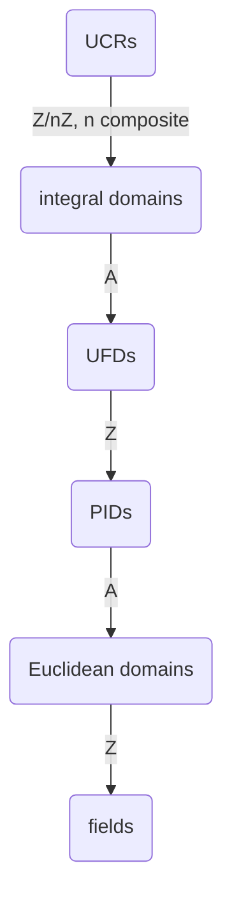

> **Chapter status:** &nbsp; 🚧 &nbsp; draft &nbsp; 🚧
>
> **TODO:**

# Rings

We cover the general theory of rings with a focus on $\ZZ$ and $\ZZ_n$.
The specific and important case of polynomial rings will be covered in a [dedicated chapter](polynomials.md).

## Contents

<!-- toc -->

## Basic Definitions

A ***ring*** is a non-empty set $\AA$ equipped with two binary operations $+$ and $\cdot$, respectively called addition and multiplication, satisfying the following properties:

- $(\AA,+)$ is an abelian group;
- multiplication is associative, i.e., for every $a,b,c \in \AA$,
\[
 (a \cdot b) \cdot c = a \cdot (b \cdot c);
\]
- multiplication is distributive with respect to addition, i.e., for every $a,b,c, \in \AA$,
\[\begin{aligned}
 & a \cdot (b+c) = a\cdot b + a \cdot c, \\
 & (b+c)\cdot a = b \cdot a + c \cdot a.
\end{aligned}\]

In all this chapter, we will mostly be interested in rings satisfying the following two additional properties:

- there exists an identity element for multiplication (also called ***unity***, not to be confused with *units* that will be defined later), i.e., there exists $e \in \AA$ such that for every $a \in \AA$,
\[
 a \cdot e = e \cdot a = a;
\]
- multiplication is commutative.

A ring satisfying the first additional property is said ***unitary*** (or sometimes simply called *ring with unity*).
A ring satisfying the second additional property is said ***commutative***.
A ring satisfying both properties is called a ***unitary commutative ring***, or UCR for short.{{footnote: Some authors include the existence of unity in the axioms defining a ring, and call a ring without unity a *rng* (ring without a $i$). In that case, a UCR is just a commutative ring. See [Wikipedia](https://en.wikipedia.org/wiki/Ring_(mathematics)#Multiplicative_identity_and_the_term_%22ring%22).}}

```admonish remark
The adjectives commutative or non-commutative applied to a ring always refer to the multiplication operation.
Addition in a ring is always commutative by definition.
```

If a ring has a unity, then it is necessarily unique (by the same proof as {{ref: prop:unique_identity_inverse}}).

The additive identity is usually denoted $0$ (or $0_{\AA}$ if one wants to avoid confusion with *integer* $0$), the additive inverse of $a$ is usually denoted $-a$, and the unity is usually denoted $1$ (or $1_{\AA}$ if one wants to avoid confusion with *integer* $1$).
The dot symbol for multiplication is often omitted and $a \cdot b$ simply written $ab$.
We adopt these conventions in the rest of this chapter (unless the dot symbol is required for aesthetic reasons).

The axioms of a ring allow to derive many natural properties about the "interplay" between addition and multiplication.

{{prop}}{prop:zero_absorbing}
*Let $\AA$ be a ring. Then 0 is an absorbing element, meaning that for every $a \in \AA$,
\[
 0 \cdot a = a \cdot 0 = 0.
\]*

``` admonish proof collapsible=true
By distributivity, we have $0 \cdot a + 0 \cdot a = (0+0) \cdot a =0 \cdot a$.
Adding $-(0 \cdot a)$ to both sides of the equation, we obtain $0 \cdot a = 0$.
A similar reasoning shows that $a \cdot 0 = 0$.
```

{{prop}}
*Let $\AA$ be a ring.
Then for every $a,b \in \AA$,
\[
 (-a)b = -(ab) = a(-b).
\]*

``` admonish proof collapsible=true
By distributivity, $ab + (-a)b = (a-a)b = 0 \cdot b = 0$ where for the last equality we used {{ref: prop:zero_absorbing}}.
Hence, $(-a)b$ is the additive inverse of $ab$, i.e., $-(ab)$.
A similar reasoning shows that $a(-b) = -(ab)$.
```

The set $\{0\}$ with addition and multiplication defined as $0+0=0$ and $0 \cdot 0 =0$ is a ring called the ***trivial ring*** or ***zero ring***.
This ring has a unity, namely $1=0$.
In fact, any unitary ring such that $1=0$ is the trivial ring since in that case, for any $a \in \AA$, $a = 1 \cdot a = 0 \cdot a = 0$.

As for groups denoted additively, we can define repeated addition (sometimes called *scaling* or *scalar multiplication*) for $a \in \AA$ and $k \in \ZZ$ as
\[
 ka \defeq
 \begin{cases}
  0 & \text{if } k=0 \\
  \underbrace{a + \cdots + a}_ {k \text{ terms}} & \text{if } k > 0 \\[3ex]
  \underbrace{(-a) + \cdots + (-a)}_ {-k \text{ terms}} & \text{if } k < 0.
 \end{cases}
\]

Note that we use the same notation for the *internal* multiplication operation of the ring, $ab$ with $a,b \in \AA$, and the *external* operation of scalar multiplication of a ring element with an integer, $ka$ with $a \in \AA$ and $k \in \ZZ$.

If $\AA$ is unitary with unity $1_{\AA}$, then for any $k \ge 0$ one has
\[\begin{aligned}
 ka & = a + \cdots + a \\
 & = 1_{\AA} a + \cdots + 1_{\AA} a \\
 & = (1_{\AA} + \cdots + 1_{\AA}) a \\
 & = (k 1_{\AA}) a.
\end{aligned}\]
Hence, when $\AA$ has a unity, we can adopt the convention that $k$ also denotes the ring element $k 1_{\AA}$: the result of $ka$ coincides, whether we interpret it as the multiplication of two ring elements or the scalar multiplication of ring element $a$ by integer $k$.

Similarly, we can defined repeated multiplication (more commonly called *exponentiation*) for $a \in \AA$ and $k \in \NN$ as
\[
 a^k \defeq
 \begin{cases}
  1 & \text{if } k=0 \\
  \underbrace{a \cdots a}_ {k \text{ terms}} & \text{if } k > 0.
 \end{cases}
\]

Note that $a^k$ for $k < 0$ cannot be defined unless $a$ has a [multiplicative inverse](#units).

```admonish example
```

## Characteristic

Let $\AA$ be a UCR (or more generally a unitary ring).
The ***characteristic*** of $\AA$, denoted $\charac(\AA)$, is the [exponent](./groups.md#exponent-of-a-group) of the additive group $(\AA,+)$.
In other words, it is the smallest integer $n \ge 1$ such that for every $a \in \AA$, $na = 0$, or 0 if no such integer exists.{{footnote: Unlike the general definition of the exponent of a group for which there are two conventions (infinite exponent versus exponent 0), the characteristic of a ring is universally defined as an integer, meaning one never talks of a ring of infinite characteristic.}}

An equivalent definition is given by the following proposition.

{{prop}}{prop:char_is_unity_additive_order}
*Let $\AA$ be a UCR.
Then $\charac(\AA)$ is equal to the additive order of 1 if it is finite, or 0 if 1 has infinite order.*

``` admonish proof collapsible=true
Assume that the additive order $n$ of 1 is finite.
Then, for every $a \in \AA$,
\[
 na = n(1 \cdot a) = (n1) \cdot a = 0 \cdot a = 0.
\]
Moreover, there cannot exists $n' < n$ such that for every $a \in \AA$, $n' a =0$ as this would imply $n' 1 = 0$ and would contradict that $n$ is the additive order of 1.
Hence, $\charac(\AA) = n$.

Assume now that the additive order of 1 is infinite.
Then for every $n \ge 1$, $n1 \neq 0$ and hence by definition, $\charac(\AA) = 0$.
```

Note in particular that a ring of characteristic 0 must necessarily be infinite.

{{prop}}{prop:freshman_exp}[Freshman Exponentiation]
*Let $\AA$ be a commutative ring with prime characteristic $p$.
Then for every $a,b \in \AA$,
\[
 (a+b)^p = a^p + b^p.
\]*

``` admonish proof collapsible=true
By induction on $n$, one can show that for every $n \in \NN$, the binomial theorem holds, i.e.,
\[
(a+b)^n = \sum_{k=0}^n \binom{n}{k} a^k b^{n-k}.
\]
Taking $n=p$, one has
\[
\binom{p}{k} = \frac{p!}{k!(p-k)!} = \frac{p(p-1)\cdots(p-k+1)}{k!}.
\]
For $k \in \{1,\dots,p-1\}$, $k!$ divides $p(p-1)\cdots(p-k+1)$ and is coprime with $p$, hence $k!$ divides $(p-1)\cdots(p-k+1)$ and $\binom{p}{k}$ is a multiple of $p$, which implies that
\[
 \binom{p}{k} a^k b^{p-k} = 0
\]
since the ring has characteristic $p$.
Hence, only the terms corresponding to $k=0$ and $k=p$ are non-zero in the sum and
\[
(a+b)^p = \sum_{k=0}^p \binom{p}{k} a^k b^{p-k} = \binom{p}{0}a^0b^p + \binom{p}{p}a^p b^0 = a^p + b^p.
\]
```

## Direct Product

As for groups, one can define the ***direct product*** of two rings $\AA$ and $\BB$ as the Cartesian product
\[
 \AA \times \BB \defeq \{(a,b) \mid a \in \AA, b \in \BB\}
\]
equipped with operations defined component-wise:
\[\begin{aligned}
 & (a,b) + (c,d) = (a+c,b+d) \\
 & (a,b) \cdot (c,d) = (a \cdot c, b \cdot d).
\end{aligned}\]

{{prop}}
*The direct product as defined above is a ring.
If $\AA$ and $\BB$ are commutative then $\AA \times \BB$ is commutative and if $\AA$ and $\BB$ have a unity then $(1,1)$ is the unity in $\AA \times \BB$.*

## Subrings

Let $\AA$ be a ring and $\BB$ be a non-empty subset of $\AA$.
The subset $\BB$ is called a ***subring*** of $\AA$ if $\BB$ equipped with addition and multiplication (as defined for $\AA$) is a ring.

{{prop}}
*Let $\AA$ be a ring and $\BB$ be a subset of $\AA$.
Then $\BB$ is a subring of $\AA$ if and only if $\BB$ is an additive subgroup of $\AA$ and $\BB$ is stable by multiplication, i.e., for every $a,b \in \BB$, $ab \in \BB$.*

A slightly simpler subring criterion is given by the following proposition.

{{prop}}
*Let $\AA$ be a ring and $\BB$ be a subset of $\AA$.
Then $\BB$ is a subring of $\AA$ if and only if $0 \in \BB$ and for every $a,b \in \BB$, $a-b \in \BB$ and $ab \in \BB$.*

``` admonish proof collapsible=true
This follows directly from {{ref: prop:simple_subgroup_crit}} as $\BB$ is an additive subgroup of $\AA$ if and only if $0 \in \BB$ and for every $a,b \in \BB$, $a-b \in \BB$.
```

A subring $\BB$ is said ***proper*** if it is different from $\AA$.
The trivial ring $\{0\}$ is a subring of any ring.

> {{rem}}{rem:subring}
When the definition of a ring requires the existence of a unity, the standard definition of a subring not only requires that a subring $\BB$ of a ring $\AA$ has a unity (which for example implies that $2\ZZ$ is not a subring of $\ZZ$), but also that this unity is equal to the one of $\AA$. The later implies in particular that an ideal $\II$ of $\AA$ is never a subring of $\AA$ unless $\II = \AA$ (see {{ref: rem:ideal_vs_subring}}). Note that a subring of a unitary ring (according to the definition we use here) may be a unitary ring, but the unity in $\BB$ may be different from the unity in $\AA$ (see [here](https://math.stackexchange.com/questions/170953/nontrivial-subring-with-unity-different-from-the-whole-ring)).


## Units

Let $\AA$ be a UCR.
An element $a \in \AA$ is called a ***unit*** or ***invertible element*** if $a \divides 1$, i.e., if there exists $b \in \AA$ such that $ab = 1$.
If $a$ is a unit, one can show that there is a unique $b$ such that $ab = 1$ (as in {{ref: prop:unique_identity_inverse}}).
It is called the ***multiplicative inverse*** of $a$ and denoted $a^{-1}$.

> {{rem}}
More generally, one can define units in general unitary rings (not necessarily commutative) by requiring that there exists $b \in \AA$ such that $ab = ba = 1$.
If $\AA$ is commutative, then the two conditions $ab = 1$ and $ba = 1$ are of course equivalent.
For a non-commutative ring, it can be shown that these two conditions are equivalent for *finite* rings.
However, there exists infinite non-commutative rings with two elements $a$ and $b$ such that $ab = 1$ but $ba \neq 1$.
See [here](https://math.stackexchange.com/questions/138541/left-inverse-implies-right-inverse-in-a-finite-ring) and [there](https://math.stackexchange.com/questions/655186/in-a-non-commutative-monoid-is-the-left-inverse-of-an-element-also-the-right-in).

The set of units of $\AA$ is denoted $\AA^*$ or $\AA^{\times}$ (we will use the former notation).
The following proposition shows that $\AA^*$ is a group called the ***group of units*** of $\AA$.

{{prop}}
*Let $\AA$ be a unitary ring.
Then $\AA^*$ equipped with multiplication is a group.
Moreover, if $\AA$ is commutative then $\AA^*$ is abelian.*

``` admonish proof collapsible=true
To show that $\AA^*$ is a group, we must show that it is stable by multiplication, that $1 \in \AA^*$, and that the multiplicative inverse of a unit is a unit (associativity of multiplication holds by assumption that $\AA$ is a ring).
Let $a,b \in \AA^*$.
Then there exists $c,d \in \AA$ such that $ac = 1$ and $bd = 1$.
Then $ab(dc) = a(bd)c = a \cdot 1 \cdot c = ac = 1$ and hence $ab \in \AA^*$.
One obviously has $1 \in \AA^*$ since $1 \cdot 1 = 1$.
If $a \in \AA^*$, then by definition $aa^{-1} = a^{-1}a = 1$ and hence $a^{-1}$ is a unit.
Finally, it is straightforward that $\AA^*$ is abelian if $\AA$ is commutative.
```

A UCR in which every non-zero element is a unit is called a ***field***.{{footnote: In particular, the definition of a field implies that it is commutative. A general unitary ring such that every non-zero element is a unit is called a *division ring* (or *skew-field* if it is non-commutative).}}
Fields will be the subject of a dedicated chapter.

## Zero Divisors and Integral Domains

Let $\AA$ be a UCR.
An element $a \in \AA$ is called a ***zero divisor*** if $a \neq 0$ and there exists $b \in \AA \setm \{0\}$ such that $ab = 0$.
Note that, although 0 divides 0, 0 is *not* a zero divisor.

{{prop}}{prop:unit_not_zero_divisor}
*Let $\AA$ be a UCR and $a \in \AA$ be a unit.
Then $a$ is not a zero divisor.*

``` admonish proof collapsible=true
Let $a$ be a unit.
Assume that $a$ is a zero divisor.
By definition, there exists $b \in \AA \setm \{0\}$ such that $ab = 0$.
Then $a^{-1}(ab) = 0 = (a^{-1}a)b = 1 \cdot b = b$, a contradiction with $b \neq 0$.
```

In fact, in a finite UCR, a non-zero element is either a unit or a zero divisor.

{{prop}}{prop:unit_or_zero_div}
*Let $\AA$ be a finite UCR and $a \in \AA \setm \{0\}$.
Then $a$ is either a unit or a zero divisor.*

``` admonish proof collapsible=true
Let $a$ be a non-zero element of $\AA$.
Let us assume that $a$ is not a zero divisor and show that it must be a unit.
Consider the map from $\AA$ to $\AA$ defined by $b \mapsto ab$.
This map is injective: if $ab = ab'$ then $a(b-b') = 0$, which implies $b=b'$ as otherwise $a$ would be a zero divisor, a contradiction.
Since $\AA$ is finite, this map is also necessarily surjective and hence there exists $b$ such that $ab = 1$, which means $a$ is a unit.
```

A non-trivial UCR with no zero divisors is called an ***integral domain***.{{footnote: A general ring with no zero divisors is simply called a *domain*. Hence, a more logical name for an integral domain would be unitary commutative domain.}}
Equivalently, a UCR $\AA$ is an integral domain if
\[
 \forall a,b \in \AA, ab = 0 \implies (a = 0 \vee b = 0).
\]

In all the following, we will use notation $\DD$ for an integral domain.

A integral domain has the so-called *cancellation property*.

{{prop}}
*Let $\DD$ be an integral domain and $a,b,c \in \DD$.
If $a \neq 0$ and $ab=ac$, then $b=c$.*

``` admonish proof collapsible=true
Assume that $ab=ac$.
Then $a(b-c) = 0$.
Since $\DD$ is an integral domain, this implies $a=0$ or $b-c=0$.
But $a \neq 0$ by assumption, hence necessarily $b=c$.
```

{{prop}}
*The characteristic of an integral domain is either 0 or a prime number.*

``` admonish proof collapsible=true
Let $\DD$ be an integral domain with characteristic $n \neq 0$.
Assume that $n$ is composite, i.e., there exists $k,\ell \in \NN$ such that $n = k \ell$ with $1 < k < n$ and $1 < \ell <n$.
By {{ref: prop:char_is_unity_additive_order}}, $n$ is the additive order of 1.
Hence,
\[
 n 1 = 0 = (k \ell) 1 = (k 1) \cdot (\ell 1).
\]
Since $\DD$ has no zero divisors, this implies that either $k 1 = 0$ or $\ell 1 = 0$.
Since $k < n$ and $\ell < n$, this contradicts the fact that $n$ is the additive order of 1.
Hence, $n$ must be prime.
```

{{prop}}
*Let $\DD$ be a finite integral domain.
Then any non-zero element of $\DD$ is a unit.*

``` admonish proof collapsible=true
Let $a$ be a non-zero element of $\DD$.
By {{ref: prop:unit_or_zero_div}}, $a$ is either a zero divisor or a unit.
But since $\DD$ has no zero divisors, $a$ must be a unit.
```

In other words, a finite integral domain is necessarily a field.{{footnote: A different (and less trivial) result called [Wedderburn theorem](https://en.wikipedia.org/wiki/Wedderburn%27s_little_theorem) states that any finite division ring is commutative (i.e., is a field).}}
Hence, an integral domain which is *not* a field must necessarily be infinite, the primary example being of course $\ZZ$.

## Ideals and Quotient Rings

Let $\AA$ be a commutative ring and $\II$ be a subset of $\AA$.
The subset $\II$ is called an ***ideal*** of $\AA$ if it is an additive subgroup of $\AA$ and it is closed under multiplication by arbitrary elements of $\AA$, i.e., for every $a \in \II$ and $r \in \AA$, $ra \in \II$.

> {{rem}}
One can also define ideals in non-commutative rings: an additive subgroup $\II$ of $\AA$ is called a left ideal if for every $a \in \II$ and $r \in \AA$, $ra \in \II$, a right ideal if for every $a \in \II$ and $r \in \AA$, $ar \in \II$, and a two-sided ideal if it is both a left and right ideal.

Since closure under multiplication by elements of $\AA$ implies stability by multiplication (i.e., if $\II$ is an ideal then for every $a,b \in \II$, $ab \in \II$), an ideal is a subring.

{{prop}}
*If $\AA$ has a unity and $\II$ is an ideal of $\AA$ such that $1 \in \II$, then $\II = \AA$.
More generally, if $\II$ contains a unit, then $\II = \AA$.*

>{{rem}}{rem:ideal_vs_subring}
As discussed in {{ref: rem:subring}}, when the definition of a ring requires the existence of a unity (and the corresponding definition of a subring $\BB$ requires that the unity of $\AA$ belongs to $\BB$), then the only ideal of $\AA$ which is also a subring is $\AA$ itself.

{{prop}}
*The intersection of a (finite or infinite) set of ideals is an ideal.*


An ideal is somehow to a ring what a normal subgroup is to a group in the sense that ideals exactly characterize equivalence relations over $\AA$ allowing to define quotient rings.

Let $\AA$ be a ring and let $\sim$ be an equivalence relation on $\AA$.
We say that $\sim$ is *compatible with the ring structure of $\AA$* if $a \sim b$ and $c \sim d$ implies $a+c \sim b+d$ and $ac \sim bd$.
If $\sim$ is compatible with the ring structure of $\AA$, then one can define addition and multiplication over the quotient set $\AA/\!\!\sim$ (the set of all equivalence classes) as respectively $[a]+[b] = [a+b]$ and $[a] \cdot [b] = [ab]$, where $[a]$ denotes the equivalence class of $a \in \AA$.
This is well defined as compatibility of $\sim$ with the ring structure ensures that these two binary operations do not depend on the specific representatives $a$ and $b$ of each equivalence class.
Moreover, one can easily check that $\AA/\!\!\sim$ equipped with these binary operations is a ring with additive identity $[0]$, unity $[1]$ if $\AA$ is unitary, and which is commutative if $\AA$ is commutative.

The following proposition extends {{ref: prop:equiv_rel_comp_group_struct}} to rings.

{{prop}}
*Let $\AA$ be a ring and let $\sim$ be an equivalence relation on $\AA$.
Then $\sim$ is compatible with the ring structure of $\AA$ if and only if there exists an ideal $\II$ of $\AA$ such that $a \sim b \Leftrightarrow a-b \in \II$.*

``` admonish proof collapsible=true
Assume that there exists an ideal $\II$ of $\AA$ such that $a \sim b \Leftrightarrow a-b \in \II$.
Since an ideal is an additive subgroup (necessarily normal as $(\AA,+)$ is abelian), by {{ref: prop:equiv_rel_comp_group_struct}}, we know that $\sim$ is compatible with the additive group structure of $\AA$.
Let us show that it is also compatible with the multiplicative structure of $\AA$.
Assume that $a \sim b$ and $c \sim d$.
Then $a-b \in \II$ and $c-d \in \II$.
This implies that $(a-b)c = ac-bc \in \II$ on one hand and $b(c-d) = bc-bd \in \II$ on the other hand.
Hence, $ac-bc+bc-bd =ac-bd \in \II$, meaning $ac \sim bd$.

Conversely, assume that $\sim$ is compatible with the ring structure of $\AA$.
By inspection of the proof of {{ref: prop:equiv_rel_comp_group_struct}}, we know that $\II \defeq [0]$ is an additive subgroup and that $a \sim b \Leftrightarrow a-b \in \II$.
It remains to show that $\II$ is actually an ideal.
Let $a \in \II$ and $r \in \AA$.
Then $a \sim 0$ (by definition of $\II)$ and $r \sim r$ (by reflexivity).
Thus, by compatibility with the multiplicative structure of $\AA$, $ar \sim 0 \cdot r$, hence $ar \sim 0$ meaning $ar \in \II$.
```


## Homomorphisms and Isomorphisms

Let $\AA$ and $\AA'$ be two rings.

- A ***ring homomorphism*** is a function $f$ from $\AA$ to $\AA'$ such that for every $a,b \in \AA$, $f(a+b) = f(a) + f(b)$ and $f(ab) = f(a) f(b)$.
- If $\AA = \AA'$, then $f$ is called a ***ring endomorphism***.
- If $f$ is bijective, then $f$ is called a ***ring isomorphism*** and rings $\AA$ and $\AA'$ are said ***isomorphic***, denoted $\AA \cong \AA'$.
- If $\AA= \AA'$ and $f$ is bijective, then $f$ is called a ***ring automorphism*** (hence, a ring automorphism is both a ring endomorphism and a ring isomorphism).

The following proposition gives a number of properties of ring homomorphisms.

{{prop}}{prop:ring_homomorphism_properties}
*Let $\AA$ and $\AA'$ be two rings and $f \colon \AA \to \AA'$ be a ring homomorphism. Then:*
- *$f(0) = 0$ and for every $a \in \AA$, $f(-a) = -f(a)$;*
- *if $f$ is surjective and $\AA$ is unitary, then $\AA'$ is unitary and $f(1_{\AA}) = 1_{\AA'}$; moreover, if $u \in \AA$ is a unit, then $f(u)$ is a unit in $\AA'$ and $f(u)^{-1} = f(u^{-1})$;*
- *for every subring $\BB$ of $\AA$, $f(\BB) \defeq \{f(a) \mid a \in \BB\}$ is a subring of $\AA'$;*
- *for every subring $\BB'$ of $\AA'$, $f^{-1}(\BB') \defeq \{a \in \AA \mid f(a) \in \BB'\}$ is a subring of $\AA$;*
- *if $f$ is a ring isomorphism, then the inverse function $f^{-1} \colon \AA' \to \AA$ is also a ring isomorphism;*
- *if $\AA'$ is another ring and $f' \colon \AA' \to \AA''$ is a ring homomorphism, then $f' \circ f$ is a ring homomorphism from $\AA$ to $\AA''$.*

> {{rem}}
When the definition of a ring requires the existence of a unity, then the corresponding definition of an homomorphism from $\AA$ to $\AA'$ requires that $f(1_{\AA}) = 1_{\AA'}$.
It follows that the second bullet point holds trivially, even when $f$ is not surjective.
To see why surjectivity of $f$ is required under the definition we use here, consider any example of a unitary ring $\AA$ with a subring $\BB$ which is also unitary but whose unity is different from the unity of $\AA$ (see {{ref: rem:subring}}) and consider the so-called inclusion map $f \colon \AA' \to \AA$ given by $f(a) =a$, which is not surjective since $\AA'$ is a strict subset of $\AA$.
It is obviously a ring homomorphism, but $f(1_{\AA'}) = 1_{\AA'} \neq 1_{\AA}$.

A particularly important example of ring endomorphism is $a \mapsto a^p$ in rings of prime characteristic $p$, called ***Frobenius endomorphism***.

{{prop}}{prop:frobenius}
*Let $\AA$ be a commutative ring with prime characteristic $p$.
Then $\phi \colon a \mapsto a^p$ is a ring endomorphism of $\AA$.*

``` admonish proof collapsible=true
For every $a,b \in \AA$, one clearly has $\phi(ab) = \phi(a)\phi(b)$ since $(ab)^p = a^p b^p$.
Moreover, by {{tref: prop:freshman_exp}}, for every $a,b \in \AA$, one has $(a+b)^p = a^p + b^p$, i.e., $\phi(a+b) = \phi(a) + \phi(b)$.
Hence, $\phi$ is a ring homomorphism from $\AA$ to $\AA$, i.e., a ring endomorphism.
```

Let $f \colon \GG \to \GG'$ be a ring homomorphism.
Two sets related to $f$ are particularly important:

- The ***kernel*** of $f$ is the subset of $\AA$ defined as
\[
 \ker(f) \defeq \{a \in \AA \mid f(a) = 0\}.
\]
- The ***image*** of $f$ is the subset of $\AA'$ defined as
\[
 \im(f) \defeq \{f(a) \mid a \in \AA\}.
\]

By {{ref: prop:ring_homomorphism_properties}}, $\ker(f)$ is a subring of $\AA$ since it is equal to $f^{-1}({0})$ and $\im(f)$ is a subring of $\AA'$ since it is equal to $f(\AA)$.

## Divisibility

In this section, we restrict ourselves to commutative rings and generalize the notion of [divisibility](integers.md#divisibility) that we saw for integers.

Let $\AA$ be a commutative ring and $a,b \in \AA$.
We say that $a$ ***divides*** $b$, or that $a$ is a ***divisor*** of $b$, or that $b$ is a ***multiple*** of $a$, denoted $a \divides b$, if there exists $q \in \AA$ such that $b = qa$.

Two elements $a,b \in \AA$ are said to be ***associated elements*** (or ***associates***) if $a \divides b$ and $b \divides a$.

{{prop}}
*Let $\AA$ be a commutative ring.
Then being associates is an equivalence relation over $\AA$.*

``` admonish proof collapsible=true
Reflexivity and symmetry are straightforward.
Assume that $a$ and $b$ are associates and that $b$ and $c$ are associates.
Then $a \divides b$ and $b \divides c$, which implies $a \divides c$, and $c \divides b$ and $b \divides a$, which implies that $c \divides a$.
Hence the relation is transitive.
```

Given $a,b \in \AA$, a ring element $d \in \AA$ is called a ***common divisor*** of $a$ and $b$ is $d$ divides both $a$ and $b$.
It is called a ***greatest common divisor*** (GCD) if it is a common divisor and every common divisor $d'$ of $a$ and $b$ divides $d$.

In an arbitrary commutative ring, two elements may not have a greatest common divisor.
As we will see later, a sufficient condition to ensure that two elements always have a GCD is that the ring is a Unique Factorization Domain (UFD).
When $a$ and $b$ do have a GCD, one can completely describe their set of GCDs by the following proposition.

{{prop}}
*If $a$ and $b$ have a GCD $d$, then the set of their GCDs is exactly the set of associates of $d$.*

``` admonish proof collapsible=true
Let $d'$ be a GCD of $a$ and $b$.
Then $d'$ is a common divisor of $a$ and $b$.
Since $d$ is a GCD of $a$ and $b$, $d' \divides d$.
Similarly, $d$ is a common divisor of $a$ and $b$ and since $d'$ is a GCD of $a$ and $b$, $d \divides d'$.
Hence, $d$ and $d'$ are associates.

Conversely, let $d'$ be an associate of $d$.
Then $d'$ divides $d$ which is a common divisor of $a$ and $b$ and hence $d'$ is a common divisor of $a$ and $b$.
Let $d''$ be a common divisor of $a$ and $b$.
Then, since $d$ is a GCD of $a$ and $b$, $d''$ divides $d$.
Since $d$ divides $d'$, $d''$ divides $d'$, which proves that $d'$ is a GDC of $a$ and $b$.
```

## Irreducible and Prime Elements

In the following, we consider an integral domain $\DD$.

Earlier we defined ***associated elements*** (or ***associates***) as two elements $a,b \in \DD$ such that $a \divides b$ and $b \divides a$.
Equivalently, in an integral domain, $a$ and $b$ are associates *iff* there exists a unit $u$ such that $a = ub$.
For completeness, we prove equivalence of these two definitions.

{{prop}}{prop:associates}
*Let $\DD$ be an integral domain and $a,b \in \DD$.
Then
\[
 (a \divides b) \wedge (b \divides a) \iff \exists u \in \DD^*, a = ub.
\]*

``` admonish proof collapsible=true
Assume first that $a = ub$ for some unit $u$.
Then by definition $b \divides a$.
This also implies $b = u^{-1}a$ and hence $a \divides b$.
Conversely, assume that $a \divides b$ and $b \divides a$.
Then $a = cb$ and $b = da$ for some $c,d \in \DD$.
If $a = b = 0$ then the conclusion trivially holds with $u=1$.
Assume now that $a$ or $b$ is not 0.
If $a \neq 0$, then multiplying $b = da$ by $c$ we get $cb = cda = a$.
Since $a \neq 0$ and $\DD$ is an integral domain, by the cancellation property, it follows that $cd=1$ and hence $c$ is a unit.
The reasoning is similar for the case $b \neq 0$.
```

Two important notions when studying integral domains are irreducibility and primality.

A non-zero element $a \in \DD$ is ***irreducible*** if $a$ is not a unit and the only divisors of $a$ are units and $a$'s associates.
In other words, for every $b,c \in \DD$, if $a = bc$ then $b$ or $c$ is a unit.
An element $a \in \DD$ which is not a unit and not irreducible is ***reducible***: it can be written $a = bc$ where neither $b$ nor $c$ is a unit.

Note that this definition of irreducibility corresponds to the usual notion of primality in $\ZZ$.
For general integral domains, though, there is a separate (and not always equivalent, as we will see) notion of primality.

A non-zero element $a \in \DD$ is ***prime*** if $a$ is not a unit and for every $b,c \in \DD$,
\[
 a \divides bc \implies (a \divides b) \vee (a \divides c).
\]

{{prop}}
*In an integral domain, a prime element is always irreducible.*

``` admonish proof collapsible=true
Let $a \in \DD$ be a prime element.
Assume that $a = bc$.
Then in particular $a \divides bc$ and hence $a \divides b$ or $a \divides c$.
Assume that $a \divides b$, i.e., there is $d \in \AA$ such that $b = da$.
Then $bc = dac = a$ and hence since $a \neq 0$, by the cancellation property, $cd = 1$ and $c$ is a unit.
The reasoning is similar if $a \divides c$.
```

In a non-integral domain, a prime element can be reducible.
For example, in $\ZZ_6$, $3$ is reducible because $3 = 3 \cdot 3 \bmod 6$ and $3$ is not a unit.
But $3$ is also prime.

## Euclidean Domains

Let $\DD$ be an integral domain.
$\DD$ is an ***Euclidean domain*** is there exists a function $f \colon \DD \setm \{0\} \to \NN$ such that for every $a,b \in \DD$ with $b \neq 0$, there exists $q,r \in \DD$ such that $a = qb+r$ and either $r=0$ or $f(r) < f(b)$. The elements $q$ and $r$ are respectively called ***quotient*** and ***remainder*** of the Euclidean division of $a$ by $b$ (note that they are not required to be unique).
The function $f$ is called a Euclidean function or norm (a Euclidean domain may have more than one Euclidean function.)


## Principal Ideal Domains


## Unique Factorization Domains


## Summary




## The Ring of Integers

The most fundamental example of a ring is
\[
 \ZZ = \{\dots, -2, -1 , 0, 1, 2, \dots\},
\]
the ring of integers equipped with addition and multiplication.

It is an integral domain with units $1$ and $-1$.

## Quadratic Integer Rings